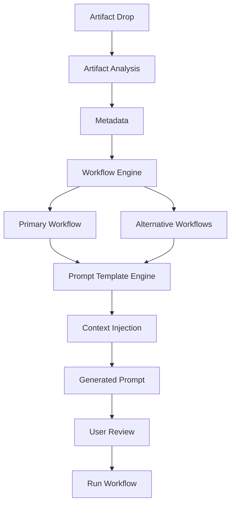

# Implementation Plan — Workflow Prediction Engine V1

This plan details the design and architecture for the **Workflow Prediction Engine V1** in Refinzi. This feature shifts the drag-and-drop intelligence from generic classification/action selection to **proactive workflow prediction, alternative options, and automated context-injected prompt generation**.

---

## Technical Flow Architecture

We will implement the exact pipeline matching your structural design:

---

## Target Supported Workflows
1. `competitor_research`
2. `product_review`
3. `learning_notes`
4. `market_research`
5. `data_analysis`
6. `content_creation`
7. `startup_strategy`
8. `fundraising_analysis`
9. `ux_audit`
10. `dashboard_review`

---

## Detailed Components

### 1. Artifact Analysis & Metadata Extraction
- **MIME/Extension Checks**: Detect CSV, DOCX, Images, YouTube URLs, Instagram URLs, generic URLs, or raw text.
- **Local Scraping**: 
  - For YouTube: Resolve video titles and author using the oEmbed API.
  - For Generic URLs: Scrape title and description snippet.
  - For DOCX/CSV: Extract row/column stats and content snippet.

### 2. Workflow Prediction Engine
- Analyzes the artifact content and metadata via Gemini.
- Predicts:
  - **Primary Workflow**: The single most probable workflow with its confidence score (e.g. `ux_audit`, 92%).
  - **Alternative Workflows**: A list of 2-3 other applicable workflows from the supported list.
- If the user switches to an alternative workflow in the UI, it updates the prompt generation.

### 3. Prompt Template Engine & Context Injection
- Integrates the selected workflow style guidelines.
- **Context Injection**: Combines the specific artifact metadata (e.g., video title, spreadsheet columns) with the prompt instruction template.
- Generates a fully fleshed out, ready-to-use prompt targeted exactly at the data.

### 4. User Review & Execution (UI)
- The transparent Orb window is resized to `350x430` to display the card.
- Displays:
  - Artifact info & Metadata.
  - Primary Workflow name and its Confidence Score.
  - Quick switch chips for **Alternative Workflows**. Clicking one regenerates the prompt for that workflow.
  - An editable textarea loaded with the **Generated Prompt**.
  - A primary `[🚀 Run Workflow]` button.
- Clicking the button runs the final prompt and pastes the output at the user's active cursor.

---

## Verification Plan

### Manual Verification
- **Test case matching examples**:
  - Drop a link to `advisorcopilot.io`. Verify it predicts `competitor_research` as primary and suggests options like `market_research` as alternatives.
  - Drop a dashboard screenshot. Verify it predicts `dashboard_review` or `ux_audit` and loads the custom review prompt.
  - Drop a YouTube video. Verify switching between primary (`learning_notes`) and alternatives updates the prompt template.
- **Refinement Execution**: Ensure running the workflow performs the AI request and auto-pastes the output into the user's focus window correctly.
