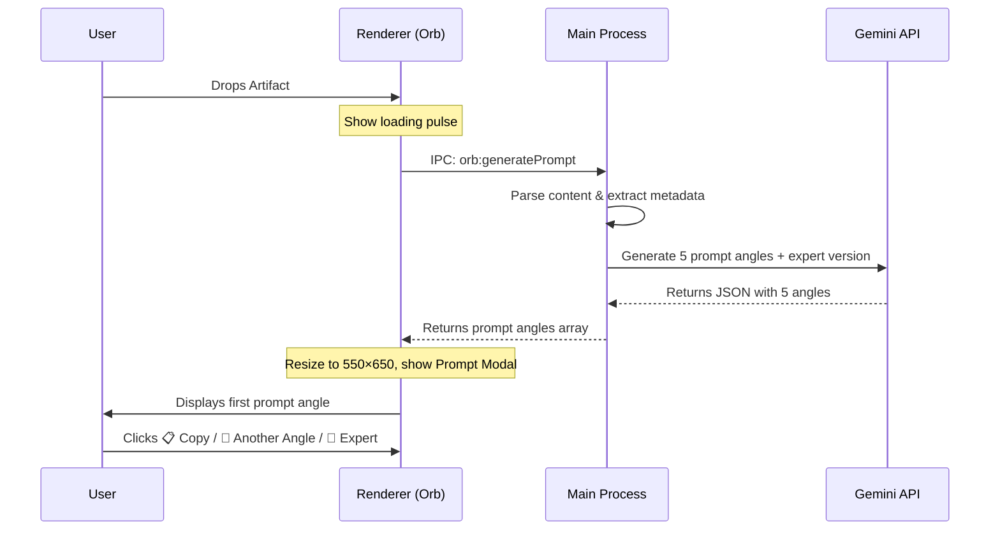

# Refinzi Artifact Prompt Generation V1

Replace the current "Workflow Prediction Card" (confidence scores, workflow chips, metadata dashboard) with a streamlined **Prompt Modal** experience: **Drop → Receive Prompt → Copy**.

The entire artifact understanding, intent inference, and workflow prediction engine stays **internal**. The user never sees classifications, confidence scores, or workflow names. They see only a beautifully generated prompt and three action buttons.

---

## User Review Required

> [!IMPORTANT]
> **Complete UI Paradigm Shift**: The current card shows `Predicted Workflow`, `Confidence Badge`, `Alternative Workflow Chips`, and a `Run Workflow` button. All of this is removed. The new modal shows **only** the generated prompt with `📋 Copy Prompt`, `🔄 Another Angle`, `🧠 Expert Mode`, and `✕ Close` buttons. No metadata, no scores, no classification screen.

> [!IMPORTANT]
> **Window Size Change**: The orb expands from `220×120` → `550×650` for the prompt modal (up from the current `350×430` classification card). The larger canvas is necessary to display high-quality prompts without excessive scrolling.

> [!WARNING]
> **"Another Angle" uses pre-generated angles, not live AI calls**: When the artifact is first analyzed, Gemini generates **5 prompt angles** in a single API call. The `🔄 Another Angle` button cycles through them client-side with zero latency. Once all 5 are shown, cycling restarts from angle 1.

---

## Open Questions

> [!IMPORTANT]
> **Expert Mode output destination**: The spec says Expert Mode should "add assumptions, tradeoffs, risks, blind spots, strategic opportunities." Two options:
> 1. **Replace in-place**: Replace the current prompt text in the modal with the expert-enhanced version (recommended — keeps the "copy prompt" workflow intact).
> 2. **Append below**: Show the expert additions below the original prompt.
> 
> The plan assumes option 1 (replace in-place).

---

## Architecture

The internal flow remains the same, but outputs change:



---

## Proposed Changes

### Main Process — AI / Prompt Generation

#### [MODIFY] [artifactAnalyzer.js](file:///e:/Antigravity%20Projects/Refinezy/Refinzi%202.0/src/main/artifactAnalyzer.js)

**Complete rewrite of the system prompt and response schema.** The existing `WORKFLOW_PREDICTION_SYSTEM_PROMPT` (which returns `workflowPrediction`, `confidence`, `alternatives`, single `generatedPrompt`) is replaced with a new `PROMPT_GENERATION_SYSTEM_PROMPT` that:

- Infers user intent internally (never exposed)
- Generates **5 distinct prompt angles**, each from a fundamentally different perspective
- Generates an **expert-mode prompt** (with assumptions, tradeoffs, risks, blind spots, opportunities) for the first angle
- Returns a flat JSON:

```json
{
  "angles": [
    { "label": "Competitor Analysis", "prompt": "..." },
    { "label": "Market Research", "prompt": "..." },
    { "label": "Startup Strategy", "prompt": "..." },
    { "label": "Positioning Review", "prompt": "..." },
    { "label": "Product Benchmarking", "prompt": "..." }
  ],
  "expertPrompt": "..."
}
```

- **New export**: `generatePromptAngles(data)` — replaces `analyzeArtifact()`. Reuses all existing parser methods (`extractTextFromDocx`, `parseCsv`, `fetchUrlMetadata`, `fetchYouTubeMetadata`) unchanged.
- **Remove export**: `regeneratePromptForWorkflow()` — no longer needed.
- **Keep**: `ruleBasedFallback()` updated to return 5 angle objects instead of workflow names.
- **Keep**: All existing file/URL parsing logic intact.

The image/screenshot handling follows the spec's intent-inference rules:
- Pinterest images → "Recreate Design Prompt"
- Landing page screenshots → "UX Review Prompt"  
- Dashboard screenshots → "Product Audit Prompt"
- Marketing creatives → "Generate Similar Creative Prompt"

---

#### [MODIFY] [orbWindow.js](file:///e:/Antigravity%20Projects/Refinezy/Refinzi%202.0/src/main/orbWindow.js)

**IPC handler changes** in `registerPipelineHandler()`:

- **Replace** `orb:analyzeArtifact` handler → `orb:generatePrompt` — calls the new `generatePromptAngles()` instead of `analyzeArtifact()`.
- **Remove** `orb:regeneratePromptForWorkflow` handler — no longer needed (angles are pre-generated).
- **Add** `orb:generateExpertPrompt` handler — takes the current angle's prompt + artifact context and generates a deeper expert version via a focused Gemini call. This is triggered when the user clicks `🧠 Expert Mode`.
- **Keep** `orb:runArtifactAction` handler — still used for copy/execute flows.
- **Keep** `orb:resize`, `orb:setFocusable`, all move/drag handlers unchanged.

---

### Preload

#### [MODIFY] [sharedPreload.js](file:///e:/Antigravity%20Projects/Refinezy/Refinzi%202.0/src/preload/sharedPreload.js)

Update the `orb` API surface:

- **Replace** `analyzeArtifact` → `generatePrompt` 
- **Remove** `regeneratePromptForWorkflow`
- **Add** `generateExpertPrompt(currentPrompt, artifactData)` — calls new IPC handler
- **Keep** all other orb methods unchanged

---

### Renderer Process — Prompt Modal UI

#### [MODIFY] [index.html](file:///e:/Antigravity%20Projects/Refinezy/Refinzi%202.0/src/renderer/orb/index.html)

**Replace the entire classification card markup** (`#classificationCard`) with a new prompt modal:

```
┌─────────────────────────────────┐
│                            ✕    │
│  [Generated Prompt Text Area]   │
│  (read-only, styled, scrollable)│
│                                 │
│  ┌────────────┐ ┌─────────────┐ │
│  │📋 Copy     │ │🔄 Another   │ │
│  │   Prompt   │ │   Angle     │ │
│  └────────────┘ └─────────────┘ │
│  ┌────────────────────────────┐ │
│  │🧠 Expert Mode              │ │
│  └────────────────────────────┘ │
└─────────────────────────────────┘
```

- Remove: `#predictedWorkflow`, `#confidenceBadge`, `#alternativeChips`, `#runWorkflowBtn`, `.workflow-banner`, `.card-section` with "Alternative Workflows"
- Add: `#promptModal` container, `#promptDisplay` (read-only prompt text), `#copyPromptBtn`, `#anotherAngleBtn`, `#expertModeBtn`, `#promptCloseBtn`

---

#### [MODIFY] [styles.css](file:///e:/Antigravity%20Projects/Refinezy/Refinzi%202.0/src/renderer/orb/styles.css)

**Replace classification card styles** with prompt modal styles:

- Remove: `.workflow-banner`, `.workflow-predicted-title`, `.confidence-badge`, `.workflow-name`, `.alternative-chips`, `.alternative-chip-btn`, `.card-prompt-area`, `.run-workflow-btn` and all related selectors
- Add new styles for:
  - `.prompt-modal` — 500px wide, glassmorphic dark surface (`rgba(10, 14, 23, 0.95)`), `backdrop-filter: blur(32px)`, rounded corners (20px), smooth fade-in/scale animation
  - `.prompt-display` — styled read-only text area with `Inter` font, soft white text on dark, max-height with scrollbar, gold accent left-border
  - `.prompt-actions` — flex row for Copy + Another Angle buttons
  - `.copy-prompt-btn` — gold gradient primary button (matches existing brand)
  - `.another-angle-btn` — subtle ghost button with border
  - `.expert-mode-btn` — full-width secondary button with brain emoji
  - `.angle-indicator` — subtle "Angle 1/5" dot indicator below the prompt
  - Micro-animations: button hover lifts, copy success flash, angle transition (crossfade)

---

#### [MODIFY] [renderer.js](file:///e:/Antigravity%20Projects/Refinezy/Refinzi%202.0/src/renderer/orb/renderer.js)

**Major logic changes:**

1. **Drop handler** (`orbEl.drop`):
   - Replace `window.refinzi.orb.analyzeArtifact()` → `window.refinzi.orb.generatePrompt()`
   - Replace `showWorkflowCard(prediction)` → `showPromptModal(result)`
   - Resize window to `550×650` instead of `350×430`

2. **New function `showPromptModal(result)`**:
   - Stores the 5 angles array and expert prompt in module-level state
   - Sets `currentAngleIndex = 0`
   - Displays `angles[0].prompt` in the prompt display
   - Shows the modal with fade-in animation

3. **New function `hidePromptModal()`**:
   - Hides modal, resets state
   - Resizes window back to `220×120`
   - Restores orb sparkle/brain state

4. **Copy Prompt button**:
   - Reads prompt text from display element
   - Calls `navigator.clipboard.writeText()` (or IPC to main for clipboard)
   - Brief "✅ Copied!" flash animation on the button

5. **Another Angle button**:
   - Increments `currentAngleIndex = (currentAngleIndex + 1) % 5`
   - Crossfade-transitions the prompt display text
   - Updates angle indicator dots
   - No API call — instant, from pre-cached angles

6. **Expert Mode button**:
   - Calls `window.refinzi.orb.generateExpertPrompt(currentPrompt, artifactData)`
   - Shows a brief loading state on the button
   - Replaces prompt display with the expert-enhanced prompt
   - Button changes to "🧠 Expert Mode Active" (disabled state, already applied)

7. **Remove**: `showWorkflowCard()`, `hideWorkflowCard()`, all workflow card event listeners, chip generation, `runWorkflowBtn` handler, `regeneratePromptForWorkflow` calls

---

## File Change Summary

| File | Action | Scope |
|------|--------|-------|
| [artifactAnalyzer.js](file:///e:/Antigravity%20Projects/Refinezy/Refinzi%202.0/src/main/artifactAnalyzer.js) | MODIFY | New system prompt, 5-angle generation, remove workflow prediction exports |
| [orbWindow.js](file:///e:/Antigravity%20Projects/Refinezy/Refinzi%202.0/src/main/orbWindow.js) | MODIFY | Replace/add IPC handlers for new flow |
| [sharedPreload.js](file:///e:/Antigravity%20Projects/Refinezy/Refinzi%202.0/src/preload/sharedPreload.js) | MODIFY | Update orb API surface |
| [index.html](file:///e:/Antigravity%20Projects/Refinezy/Refinzi%202.0/src/renderer/orb/index.html) | MODIFY | Replace card HTML with prompt modal |
| [styles.css](file:///e:/Antigravity%20Projects/Refinezy/Refinzi%202.0/src/renderer/orb/styles.css) | MODIFY | Replace card styles with prompt modal styles |
| [renderer.js](file:///e:/Antigravity%20Projects/Refinezy/Refinzi%202.0/src/renderer/orb/renderer.js) | MODIFY | Replace card logic with prompt modal logic |

No new files. No deleted files. All changes are modifications to existing modules.

---

## Verification Plan

### Automated Tests
- `npm start` — confirm Electron starts without IPC registration errors

### Manual Verification
1. **URL drop**: Drop `advisorcopilot.io` → prompt modal appears with competitor analysis prompt → click Another Angle 4 times → each angle is distinct (Market Research, Startup Strategy, etc.) → 5th click cycles back to angle 1
2. **Image drop**: Drop a Pinterest screenshot → prompt infers "recreate design" intent → Expert Mode adds assumptions and strategic context
3. **CSV drop**: Drop a dataset → data analysis prompt generated → Copy Prompt copies to clipboard correctly
4. **YouTube link drop**: Drop a founder interview URL → learning extraction prompt generated
5. **Copy button**: Verify prompt is in clipboard after click, button shows "✅ Copied!" flash
6. **Expert Mode**: Verify richer prompt replaces original, button becomes disabled/active state
7. **Close button**: Modal closes, orb resizes back to `220×120`, sparkle restores
8. **Speed**: Drop-to-prompt should complete within ~2 seconds (single API call for all 5 angles)
