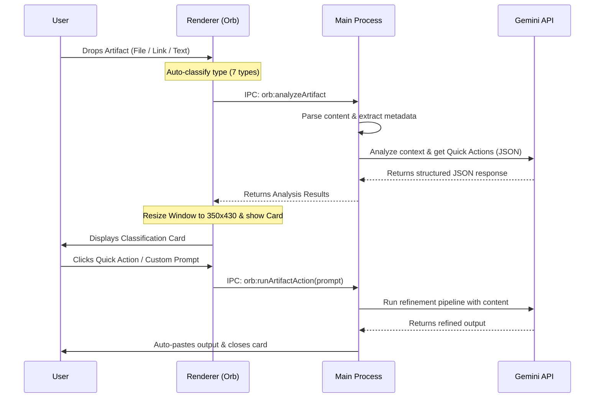

# Implementation Plan — Artifact Intelligence V1

This plan details the design and architecture for **Artifact Intelligence V1** in Refinzi. This feature automatically classifies dropped artifacts (files or text/links), extracts metadata, infers the user's intent using Gemini, and presents a premium, lightweight interactive card with quick actions and suggested prompts.

---

## User Review Required

> [!IMPORTANT]
> **Window Resize & Focus Management:**
> To allow the user to click action buttons and type custom prompts inside the classification card, the floating orb window needs to expand from its default compact size (`220x120`) to `350x430`. We will dynamically enable focusability (`win.setFocusable(true)`) when the card is shown, and restore it to non-focusable (`win.setFocusable(false)`) when the card is closed. This prevents keyboard focus stealing when the orb is idle.

> [!TIP]
> **Zero-Dependency DOCX Parsing:**
> Rather than adding heavy third-party npm packages, we will implement a lightweight, self-contained XML/Decompression-based parser for `.docx` files. This leverages Node's built-in `zlib` to extract `word/document.xml` and parsed `<w:t>` text tags, keeping the app lightweight and secure.

---

## Open Questions

> [!WARNING]
> 1. **Destination of the Pipeline Output:** When the user clicks a quick action (e.g. "⚡ Summarize"), should Refinzi execute the task and paste the final AI-generated response directly in place of the active selection (similar to selected text refinement), or copy it to the clipboard? We propose following the standard Refinzi workflow: run the pipeline, auto-paste into the active window, and fall back to clipboard copy if auto-paste fails.
> 2. **Handling Large Files:** Large files (e.g., massive CSV tables or long DOCX files) can exceed Gemini's prompt limit or latency bounds. We propose extracting a clean preview (first 1000 lines for CSV, first 10,000 characters for DOCX) to pass to the inference model for metadata/intent analysis, but using the full content during final task execution.

---

## Proposed Changes

We will introduce a robust artifact intelligence layer across both the main process and the renderer process.

---

### Main Process

#### [NEW] [artifactAnalyzer.js](file:///e:/Antigravity%20Projects/Refinezy/Refinzi%202.0/src/main/artifactAnalyzer.js)
Create a helper module to parse dropped artifacts and communicate with Gemini to get intelligence results:
- **Parser Methods**:
  - `extractTextFromDocx(filePath)`: Parses `.docx` zip files using Node `zlib` and extracts `<w:t>` nodes.
  - `parseCsv(filePath)`: Reads CSV files, counts rows/columns, extracts header names, and generates previews.
  - `fetchUrlMetadata(url)`: Fetches HTML pages (with a timeout) and extracts the title, meta description, and first 1000 characters.
  - `fetchYouTubeMetadata(url)`: Calls the YouTube oEmbed API to resolve titles and channel info quickly.
- **Gemini Intelligence Call**:
  - Uses the active Gemini or OpenRouter API key.
  - Calls Gemini with a system prompt specifying a strict JSON schema containing: `classification`, `likelyIntent`, `quickActions` (array of `{id, label, prompt}`), and `suggestedPrompts` (array of strings).
  - Handles image data via multimodal base64 transfer if the artifact is an image.

#### [MODIFY] [orbWindow.js](file:///e:/Antigravity%20Projects/Refinezy/Refinzi%202.0/src/main/orbWindow.js)
Register new IPC handlers to manage the interaction state:
- `orb:analyzeArtifact`: Invokes `artifactAnalyzer.js` to process the dropped file/link/text and returns the classification card payload.
- `orb:runArtifactAction`: Takes the chosen prompt and the stored artifact content, runs the standard refinement pipeline, and auto-pastes the output.
- `orb:resize`: Resizes the BrowserWindow.
- `orb:setFocusable`: Toggles focusability on the orb window so the user can type in the card's input field.
- Modify `GeminiProvider.js` `refine` to support optional `media` payloads (base64 images) and structured JSON outputs.

---

### Renderer Process (Orb Window)

#### [MODIFY] [artifactClassifier.js](file:///e:/Antigravity%20Projects/Refinezy/Refinzi%202.0/src/renderer/orb/artifactClassifier.js)
Extend classification to support all 7 types:
- **Text**: Default fallback.
- **URL**: Matches standard http/https links.
- **YouTube Link**: Matches `youtube.com` or `youtu.be` domains.
- **Instagram Link**: Matches `instagram.com` domains.
- **Image**: Matches `.png, .jpg, .jpeg, .webp` files or `image/*` MIME type.
- **DOCX**: Matches `.docx` files.
- **CSV**: Matches `.csv` files.

#### [MODIFY] [index.html](file:///e:/Antigravity%20Projects/Refinezy/Refinzi%202.0/src/renderer/orb/index.html)
Add structural HTML for the lightweight classification card overlay. This card will display:
- Artifact type icon and name.
- Extracted metadata (dimensions, row count, word count, video duration, website title).
- Inferred likely intent badge ("💡 Likely shared to...").
- Quick Action buttons (max 3, pill styled).
- Suggested Prompts list (clickable text cards).
- Custom prompt input box with a submit button.

#### [MODIFY] [styles.css](file:///e:/Antigravity%20Projects/Refinezy/Refinzi%202.0/src/renderer/orb/styles.css)
Apply a premium dark-mode glassmorphic style to the classification card:
- Translucent obsidian surface (`rgba(20, 20, 20, 0.85)`) with a thick `backdrop-filter: blur(20px)`.
- Soft amber-gold borders and glow elements to maintain brand design consistency.
- Animated hover actions on buttons and suggested prompts.
- Layout positioning below the orb circle, supporting mouse event handling inside the card boundaries.

#### [MODIFY] [renderer.js](file:///e:/Antigravity%20Projects/Refinezy/Refinzi%202.0/src/renderer/orb/renderer.js)
Wire up the interaction flows:
- On `drop`, show a pulsing loader in the orb and send the payload via IPC to `orb:analyzeArtifact`.
- Once the analysis payload resolves, resize the window to `350x430`, enable focusability, show the card, and populate all fields dynamically.
- Implement mouseenter/mouseleave hover states on the card to toggle Electron click-through correctly.
- Handle actions: clicking a quick action, suggested prompt, or submitting a custom prompt hides the card, resets the window size/focus, and runs `orb:runArtifactAction` to paste the result.
- Handle card closing (via the `x` button) to reset state.

---

## Verification Plan

### Automated Tests
- Build and run the app: `npm run dev`.
- Check Electron start logs for any IPC registration conflicts.

### Manual Verification
- **Drag and Drop Files**: Drop a `.docx`, `.csv`, and image file onto the orb. Confirm the card appears with extracted metadata and contextual quick actions.
- **Drag and Drop Links**: Drop a standard URL, YouTube link, and Instagram link. Confirm correct API scraping (fetching page and video titles) and correct categorisation.
- **Interaction and Hover Click-through**: Hover inside and outside the card. Confirm mouse focus shifts back to background windows when leaving the orb/card area, and clicks work inside the card.
- **Refinement Execution**: Click a quick action or custom prompt. Ensure the pipeline triggers, the output gets auto-pasted, and the card closes, restoring the orb to its default size.
